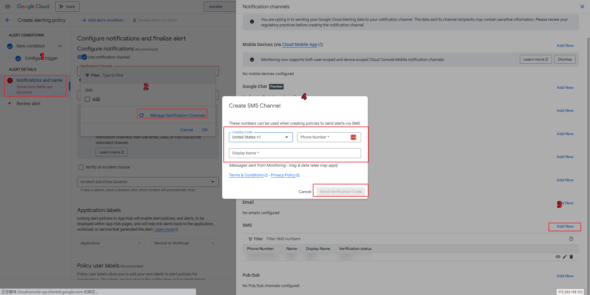
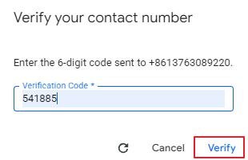
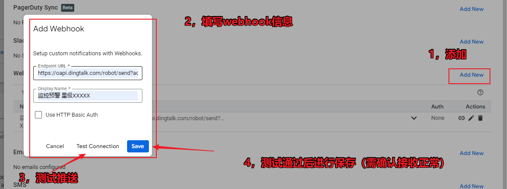

## gcp配置告警

### 

```txt

操作步骤概览（通过 Google Cloud 控制台）：

在 Google Cloud 控制台中，导航到 Monitoring 。
在左侧导航菜单中，选择 Alerting 。
点击 Create Policy 或查看现有告警策略。
选择您的 Cloud SQL 实例作为目标资源。
选择您想要监控的指标（例如 cloudsql.googleapis.com/database/cpu/utilization ）。
配置告警条件（例如，阈值、比较运算符、持续时间）。
选择通知渠道，并指定接收通知的人员或组。
命名并保存您的告警策略。

```





