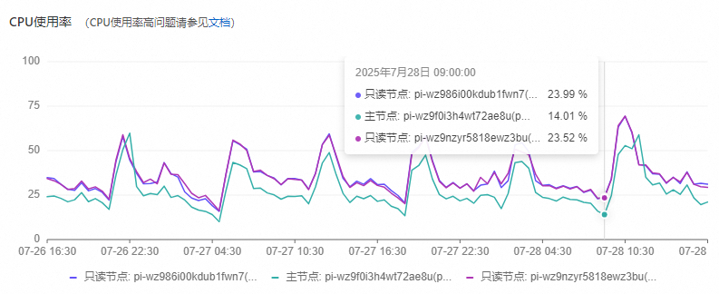

## 数据库CPU 20250728

### 备份服务器

```shell
grep '20250728 11:32:31' -A 5000  /mnt/script/test/20250728_wz9z8jb83523sr8q0_polardb_51.log | grep Num: -B 5000 | wc -l
4738
grep '20250728 11:32:31' -A 5000  /mnt/script/test/20250728_wz9z8jb83523sr8q0_polardb_51.log | grep Num: -B 5000 | awk '{print $9}' | sort -nrk1 | uniq -c | sort -nrk1 | head | awk '{total += $1} END {print "Top 10 total num:", total}'
Top 10 total num: 4315
grep '20250728 11:32:31' -A 5000  /mnt/script/test/20250728_wz9z8jb83523sr8q0_polardb_51.log | grep Num: -B 5000 | awk '{print $9}' | sort -nrk1 | uniq -c | sort -nrk1 | head
    857 `tr_tracking_info_154501_155000`
    824 `tr_user_tracknumber_42501_43000`
    757 `tr_user_tracknumber_41501_42000`
    563 `tr_user_tracknumber_155501_156000`
    430 `tr_user_tracknumber_154501_155000`
    328 `tr_tracking_info_155501_156000`
    162 UPDATE
    146 `tr_user_tracknumber_90501_91000`
    130 `tr_user_tracknumber_120001_120500`
    118 `tr_user_tracknumber_117001_117500`
grep '20250728 11:32:31' -A 5000  /mnt/script/test/20250728_wz9z8jb83523sr8q0_polardb_51.log | grep Num: -B 5000 | grep tr_tracking_info_154501_155000  > 20250728.tr_tracking_info_154501_155000.log
grep '20250728 11:32:31' -A 5000  /mnt/script/test/20250728_wz9z8jb83523sr8q0_polardb_51.log | grep Num: -B 5000 | grep tr_user_tracknumber_42501_43000  > 20250728.tr_user_tracknumber_42501_43000.log
grep '20250728 11:32:31' -A 5000  /mnt/script/test/20250728_wz9z8jb83523sr8q0_polardb_51.log | grep Num: -B 5000 | grep tr_user_tracknumber_41501_42000  > 20250728.tr_user_tracknumber_41501_42000.log
grep '20250728 11:32:31' -A 5000  /mnt/script/test/20250728_wz9z8jb83523sr8q0_polardb_51.log | grep Num: -B 5000 | grep tr_user_tracknumber_155501_156000  > 20250728.tr_user_tracknumber_155501_156000.log
grep '20250728 11:32:31' -A 5000  /mnt/script/test/20250728_wz9z8jb83523sr8q0_polardb_51.log | grep Num: -B 5000 | grep tr_user_tracknumber_154501_155000  > 20250728.tr_user_tracknumber_154501_155000.log
grep '20250728 11:32:31' -A 5000  /mnt/script/test/20250728_wz9z8jb83523sr8q0_polardb_51.log | grep Num: -B 5000 | grep tr_tracking_info_155501_156000  > 20250728.tr_tracking_info_155501_156000.log
grep '20250728 11:32:31' -A 5000  /mnt/script/test/20250728_wz9z8jb83523sr8q0_polardb_51.log | grep Num: -B 5000 | grep tr_user_tracknumber_90501_91000  > 20250728.tr_user_tracknumber_90501_91000.log
grep '20250728 11:32:31' -A 5000  /mnt/script/test/20250728_wz9z8jb83523sr8q0_polardb_51.log | grep Num: -B 5000 | grep tr_user_tracknumber_120001_120500  > 20250728.tr_user_tracknumber_120001_120500.log
grep '20250728 11:32:31' -A 5000  /mnt/script/test/20250728_wz9z8jb83523sr8q0_polardb_51.log | grep Num: -B 5000 | grep tr_user_tracknumber_117001_117500  > 20250728.tr_user_tracknumber_117001_117500.log

# 最后10条sql，都是 china-post 
select courier from tr_tracking_info_154501_155000 where id in (704928,608834,786211,904366,760633,876149,739937,817669,656841)\G
# 最前10条sql，都是 china-post 
select courier from tr_tracking_info_154501_155000 where id in (583466,615839,747437,1012694,838691,812596,835376,566296,905284,974924)\G
# 还有usps的（量最大）

```

近两天各方面数据，封谷能对上

- 发送更新（sls）
	- sz-51-scanner-pro
		- 通过查询 docs_count_es 查看


- 新版查询系统
	- 调度中心（courier为单位）-调度子项（原线路中心）（串行中，优先级数量大的先执行）-线路中心（从数量小的开始调用执行）





### 初步结论

- 查看更新情况，当前更新china-post、usps都存在峰谷的情况（可能短暂造成数据库CPU使用率过高，进而出现大量卡住sql，也就出现大量慢sql，并进一步恶化数据库性能），看是否能做削峰平谷
	- 发送更新 @昌淦 跟进
		- 确认发送间隔是否不稳定，如果是
			- 1，峰值压力可能穿透到数据库，导致CPU使用率高
			- 2，不稳定的间隔也会导致更新间隔变长
	- 更新速度（1，激活，2，更新）
		- 找@世杰 确认usps，china-post近期的维护情况

## 慢sql治理

### 20250728

```sql

-- 对比9点低谷和10:30高峰期查看可能问题原因的慢sql，从备份服务器上的show processlist日志查看到
--- --- --- 20250728 10:02:31 --- --- ---
311715435       trackingdb      172.16.10.167:39454     trackingdb      Query   7       Sending data    select count(id) as nums from tr_user_tracknumber_144501_145000 where userid=144813 and is_delete=0 and id >= 57725808 and id <= 58225807       0       0       149554415       11844860        0       0       0       0
-- 数据库查看性能数据
desc select count(id) as nums from tr_user_tracknumber_144501_145000 where userid=144813 and is_delete=0 and id >= 57725808 and id <= 58225807\G
*************************** 1. row ***************************           id: 1
  select_type: SIMPLE
        table: tr_user_tracknumber_144501_145000
   partitions: p6
         type: range
possible_keys: PRIMARY,uit
          key: PRIMARY
      key_len: 8
          ref: NULL
         rows: 1006558
     filtered: 5.00
        Extra: Using where

-- 告警群，都是前端过来的查询
51:wz9z8jb83523sr8q0 sql execution time > 120
321266420	trackingdb	172.16.10.121:31531	trackingdb	Query	1330	Sending data	select * from tr_tracking_special where track_number='0046950166772478' and userid=41733 limit 1	0	0	5132281	2760209	0	0	0	0
321273080	trackingdb	172.16.10.171:44207	trackingdb	Query	1310	Sending data	select * from tr_tracking_special where track_number='0046950166772478' and userid=41733 limit 1	0	0	5132264	2369574	0	0	0	0
-- 数据库查看性能数据
desc select * from tr_tracking_special where track_number='0046950166772478' and userid=41733 limit 1\G
*************************** 1. row ***************************
           id: 1
  select_type: SIMPLE
        table: tr_tracking_special
   partitions: NULL
         type: ALL
possible_keys: NULL
          key: NULL
      key_len: NULL
          ref: NULL
         rows: 141143635
     filtered: 1.00
        Extra: Using where

-- 数据库查看对应表结构
show create table tr_tracking_special\G
*************************** 1. row ***************************
       Table: tr_tracking_special
Create Table: CREATE TABLE `tr_tracking_special` (
  `id` int(11) unsigned NOT NULL AUTO_INCREMENT COMMENT 'id',
  `create_time` int(10) unsigned NOT NULL COMMENT '创建日期',
  `update_time` int(10) unsigned NOT NULL COMMENT '修改日期',
  `company_code` char(100) COLLATE utf8_unicode_ci NOT NULL COMMENT '查询简码',
  `track_number` char(40) COLLATE utf8_unicode_ci NOT NULL COMMENT '单号',
  `tracking_postal_code` char(50) COLLATE utf8_unicode_ci NOT NULL COMMENT '跟踪邮政编码',
  `tracking_ship_date` char(50) COLLATE utf8_unicode_ci NOT NULL COMMENT '跟踪运送日期',
  `tracking_account_number` char(50) COLLATE utf8_unicode_ci NOT NULL COMMENT '跟踪账户号码',
  `tracking_origin_country` char(50) COLLATE utf8_unicode_ci NOT NULL DEFAULT '' COMMENT '始发国',
  `tracking_key` char(50) COLLATE utf8_unicode_ci NOT NULL COMMENT '跟踪键值',
  `tracking_destination_country` char(50) COLLATE utf8_unicode_ci NOT NULL COMMENT '跟踪目的国家',
  `userid` int(11) unsigned NOT NULL COMMENT '用户id',
  PRIMARY KEY (`id`),
  UNIQUE KEY `id` (`id`),
  KEY `ct` (`company_code`,`track_number`)
) ENGINE=InnoDB AUTO_INCREMENT=159932770 DEFAULT CHARSET=utf8 COLLATE=utf8_unicode_ci ROW_FORMAT=DYNAMIC COMMENT='特殊单号查询表'

```


