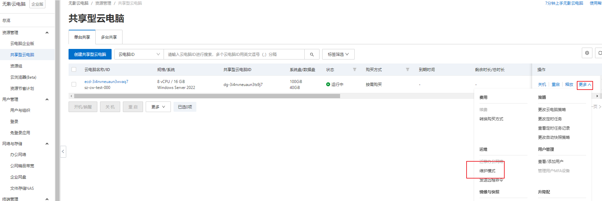
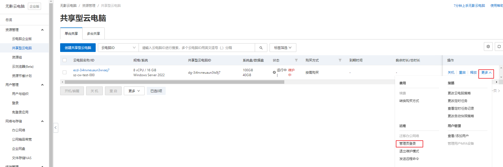
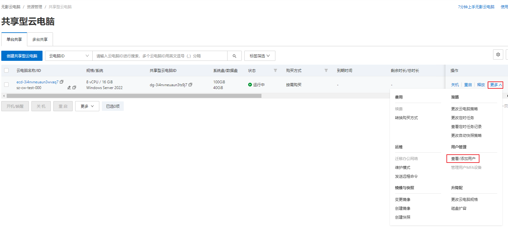
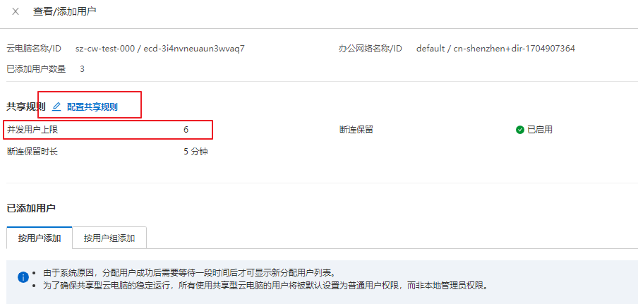
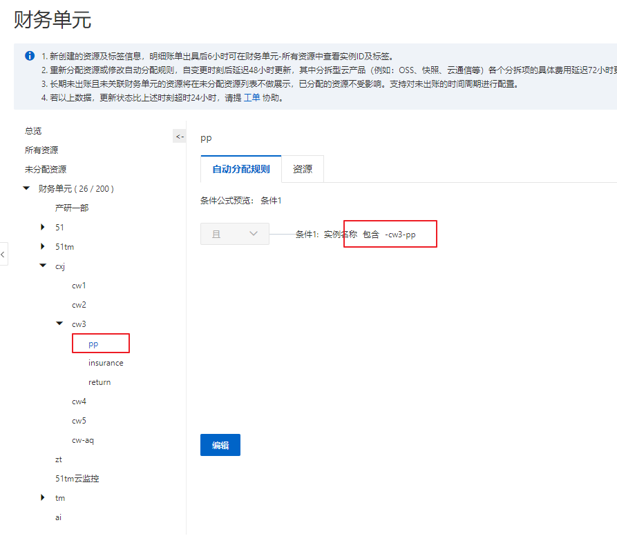
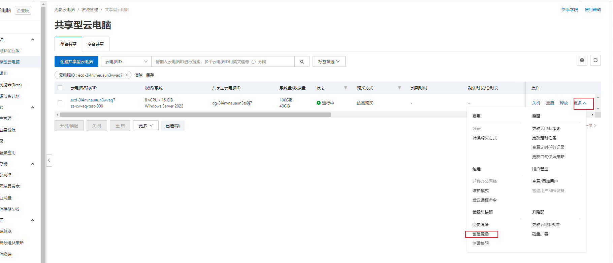
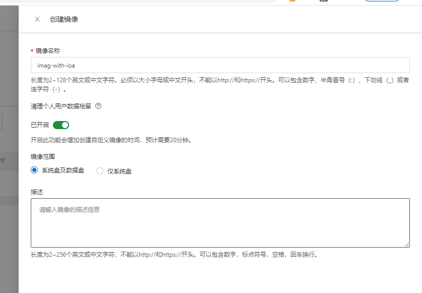
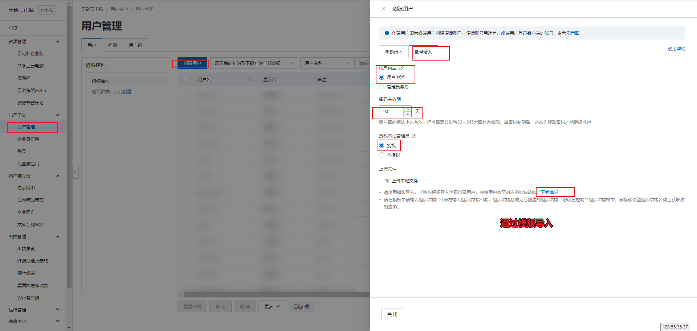
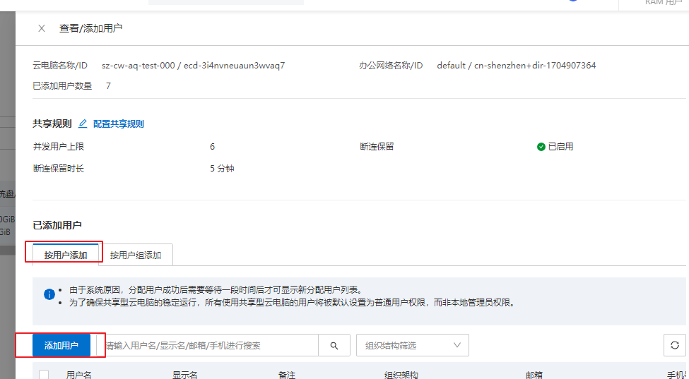

## 阿里云无影云

### 20250917

#### 背景

安全合规需要将内部系统访问入口收拢，需要指定白名单访问，远程办公（1，远程同学，2，节假日处理问题等）的情况访问人会没固定IP

#### 实施

- 选型
	- 单台共享型云电脑：支持配置并发连接数，允许多个用户同时连接使用同一台云电脑，但每个用户会处于不同的用户环境。
	- 多台共享型云电脑：是一组云电脑的集合，可以根据终端用户的连接情况自动创建、分配和释放云电脑。这种类型的云电脑适合于需要统一管理云电脑配置，但没有固定使用对象，也不需要保存个性化数据的场景，比如学校计算机实验室或网吧。
	- 可以不要固定IP，通过安装iOA拥有了
- 单台共享型云电脑
	- 安装iOA，提示需要本地管理员权限
		- 到指定云电脑-运维-进入维护模式（确保所有用户连接断开）-管理员登录-安装

本地管理权限操作，如图

### 20250919

#### 会话数修改

### 20250929

#### 命名规则

sz-cw3-pp 地区-部门-项目，目的为在财务单元中使用此规则进行分账

#### 批量操作

##### 批量创建云电脑

镜像创建（后续可用）

##### 批量创建用户

注意：用户名不能包含. 统一将邮箱@前面的.换成了_

##### 批量分配云电脑

按用户批量添加

- [ ] 待办
	- [ ] 配置备份策略
	- [ ] 配置带预装软件镜像
	- [ ] 跟进闲置关机任务异常

