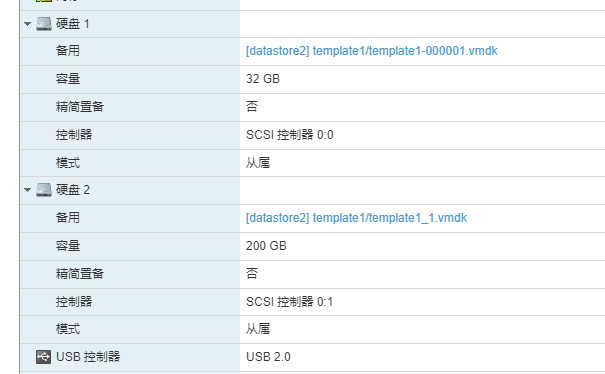
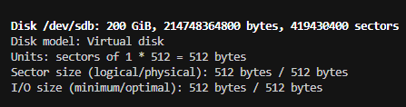

## 磁盘扩容

### esxi



lsblk或fdisk -lu查看磁盘信息，如果没显示，可尝试重启虚拟机



咨询ai
很好 👍，从你截图可以看到：

* ESXi 已经把 **硬盘 2 (200 GiB)** 提供给虚拟机了，操作系统也识别到了 → `/dev/sdb`。
* 目前这个盘 **没有分区，没有文件系统**，所以在系统里还不能直接用。

---

#### 让硬盘 2 真正“生效”的步骤（Linux 环境）

##### 1. 分区（可选）

如果你打算把整个盘直接使用，也可以跳过分区，直接格式化 `/dev/sdb`。
如果要分区：

```bash
fdisk /dev/sdb
```

在交互界面里：

* 输入 `n` → 新建分区
* 输入 `p` → 主分区
* 回车使用默认起始/结束 → 使用整盘
* 输入 `w` → 保存并退出

创建完成后，你会得到 `/dev/sdb1`。

---

##### 2. 格式化

假设你使用 **ext4** 文件系统：

```bash
mkfs.ext4 /dev/sdb1
```

---

##### 3. 挂载到目录

新建一个挂载点，比如 `/data`：

```bash
mkdir /data
mount /dev/sdb1 /data
```

测试一下：

```bash
df -h | grep /data
```

应该能看到 200G 的新盘挂载上了。

---

##### 4. 设置开机自动挂载

编辑 `/etc/fstab`，加入一行：

```fstab
/dev/sdb1   /data   ext4   defaults   0   2
```

这样系统重启后，硬盘 2 会自动挂载到 `/data`。

---

✅ 总结：
你的硬盘 2 已经被虚拟机识别，只需要 **分区 → 格式化 → 挂载 → 配置开机挂载** 就能真正生效。

---

要不要我帮你写一个 **一键脚本**（分区+格式化+挂载），你直接执行就能让硬盘 2 生效？

