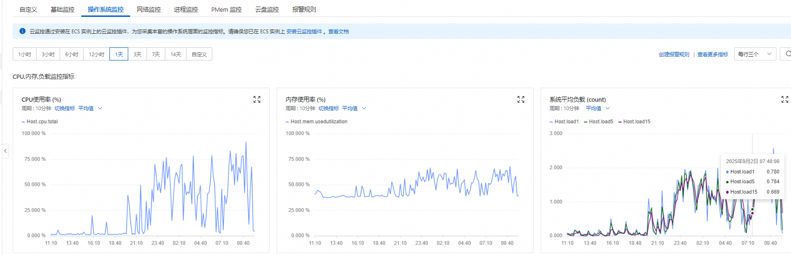
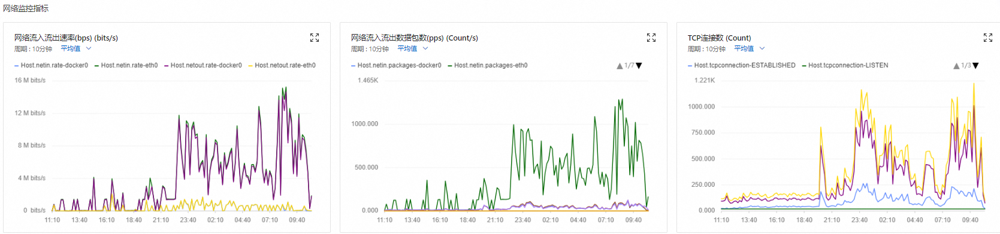
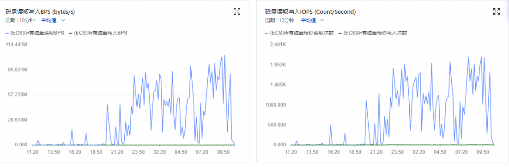
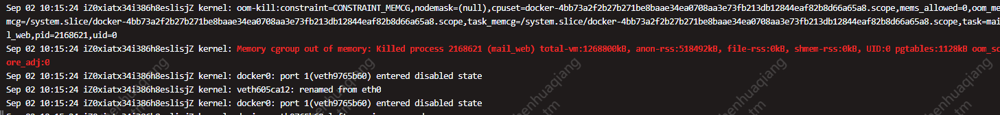
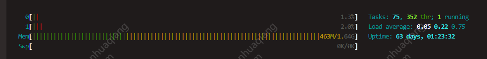

## 20250902

异常告警-upload服务器oom





```shell

# 查看系统日志，注意内容可能太多，看到最近的数据，可以调整时间，调整输出行数
# 详解 
journalctl -k --since "0.1 hours ago" -n 100 --no-pager 

```



```shell

journalctl -k -n 200 --no-pager     # 内核日志（看 OOM / overlayfs / iptables）

```

```shell

# 查看所有正在运行容器的重启次数与状态
# 找到运行时间短的可疑容器
docker ps --format 'table {{.Names}}\t{{.Status}}\t{{.RunningFor}}\t{{.Image}}\t{{.ID}}' --no-trunc
NAMES                  STATUS          CREATED         IMAGE                  CONTAINER ID
mail_queue_rewebhook   Up 2 months     17 months ago   mail-queue-rewebhook   85cbf36dbbcfd56dacb3edc01954c6be22717ff16b2ffa4e56d656a35fb68c39
mail_send_webhook      Up 2 months     17 months ago   mail_send_webhook      0b17a6088007d19f80480982810a38baf84bcd035fb15e729716d0b69f176e45
mail_queue_repush      Up 2 months     17 months ago   mail-queue-repush      de9307f67e7851efc2fe07c67955e18f24bd19a9731f3f38e333bb6e8a9673ff
mail_queue_push        Up 2 months     17 months ago   mail-queue-push        233bf170e9660a84e31d302315bc699d2c8f9ecf041a0b7d4cb3f57f71c8d24b
mail_web               Up 41 seconds   17 months ago   mail-goweb             4bb73a2f2b27b271be8baae34ea0708aa3e73fb213db12844eaf82b8d66a65a8
nginx                  Up 2 months     2 years ago     nginx                  50db71c5160076a6abb5be9455dbf84bdac5be6e3b2a56302be8c60632cc749b
upload_web             Up 2 months     2 years ago     upload-goweb           eb9c15cffb1c336f5b2ea0dba66233b2f75cfe39934b3e31b64e22b40b9c9347

docker logs -n 10 4bb73a2f2
2025/09/02 01:52:10 {"level":"INFO","msg":{"info":"controller_receiveWebhooks message","message":{"event-data":{"campaigns":[],"delivery-status":{"attempt-no":3,"certificate-verified":true,"code":451,"description":"","enhanced-code":"4.7.650","message":"4.7.650 The mail server [198.244.55.36] has been temporarily rate limited due to IP reputation. For e-mail delivery information, see https://postmaster.live.com (S775) [Name=Protocol Filter Agent][AGT=PFA][MxId=11BBC4DCB039A03C] [AMS0EPF00000196.eurprd05.prod.outlook.com 2025-09-02T01:52:10.416Z 08DDE26E62E77A85]","mx-host":"outlook-com.olc.protection.outlook.com","session-seconds":1.164,"tls":true},"envelope":{"sender":"postmaster@mail.trackingmore.net","sending-ip":"198.244.55.36","targets":"riitta.heikkinen@outlook.com","transport":"smtp"},"event":"failed","flags":{"is-authenticated":true,"is-big":false,"is-routed":false,"is-system-test":false,"is-test-mode":false},"id":"Hk9D_pmQSCSGN1pjGf146w","log-level":"warn","message":{"attachments":[],"headers":{"from":"Vorr \u003csupport@vorr.nl\u003e","message-id":"94d53c06c7e5e6745f1709bdf30556d2@vorr.nl","subject":"Ostevia™ - 1x had an Exception","to":"riitta.heikkinen@outlook.com"},"size":54203},"recipient":"riitta.heikkinen@outlook.com","recipient-domain":"outlook.com","storage":{"key":"BAABAQWAe9eI4-iOOmxKGahWHjrc3BiAZg","url":"https://storage-us-west1.api.mailgun.net/v3/domains/mail.trackingmore.net/messages/BAABAQWAe9eI4-iOOmxKGahWHjrc3BiAZg"},"tags":[],"timestamp":1756777930.4916513,"user-variables":{}},"signature":{"signature":"a6f81e283b1050ca4dfcbb4c0bf5c489a8a8867cc0efe1aa4bbc4a68ae631270","timestamp":"1756777930","token":"ee03a7b46b66d0630085becdd7c4bff84f7faed0fb98d42174"}}},"time":"2025/09/02 01:52:10"}
2025/09/02 01:52:10 {"level":"INFO","msg":{"emailSendingRecords":{"id":0,"email_sending_number":0,"email_send_rule_id":0,"appid":"","message_id":"","mail_sending_mode":0,"email_template_type":0,"email_number":"","from_email":"","from_name":"","subject":"","content":"","reply_address":"","reply_address_alias":"","unsubscribe_url":"","email_event":0,"retry_count":0,"create_time":0,"update_time":0},"error":{},"messageId":"\u003c94d53c06c7e5e6745f1709bdf30556d2@vorr.nl\u003e","msg":"controller_receiveWebhooks.ReceiveMailgunWebhooks(GetEmailSendingRecordByMessageId) get emailSendingRecords error"},"time":"2025/09/02 01:52:10"}
2025/09/02 01:52:11 {"level":"INFO","msg":{"info":"controller_receiveWebhooks message","message":{"event-data":{"campaigns":[],"delivery-status":{"attempt-no":1,"certificate-verified":true,"code":451,"description":"","enhanced-code":"4.7.650","message":"4.7.650 The mail server [159.112.252.164] has been temporarily rate limited due to IP reputation. For e-mail delivery information, see https://postmaster.live.com (S775) [Name=Protocol Filter Agent][AGT=PFA][MxId=11BBC51D0373206B] [AMS0EPF00000194.eurprd05.prod.outlook.com 2025-09-02T01:26:09.851Z 08DDE28E8C60652B]","mx-host":"eur.olc.protection.outlook.com","session-seconds":0.958,"tls":true},"envelope":{"sender":"postmaster@mail.trackingmore.net","sending-ip":"159.112.252.164","targets":"danielleathey@live.co.uk","transport":"smtp"},"event":"failed","flags":{"is-authenticated":true,"is-big":false,"is-routed":false,"is-system-test":false,"is-test-mode":false},"id":"rabTbQctRPuva-e5DuiyaA","log-level":"warn","message":{"attachments":[],"headers":{"from":"Knit \u0026 Carry \u003csupport@knitandcarry.com\u003e","message-id":"4d7031036345967c4847ba088f8b3e53@knitandcarry.com","subject":"Your order is on its way","to":"danielleathey@live.co.uk"},"size":47511},"recipient":"danielleathey@live.co.uk","recipient-domain":"live.co.uk","storage":{"key":"BAABAQUEDA6Ds9VXzdRFhrumCJMlqZEPaQ","url":"https://storage-us-west1.api.mailgun.net/v3/domains/mail.trackingmore.net/messages/BAABAQUEDA6Ds9VXzdRFhrumCJMlqZEPaQ"},"tags":[],"timestamp":1756776369.9401977,"user-variables":{}},"signature":{"signature":"819cf3471edfd029c6f273a6a6bcb2943701db8496496a8d1080afef60cccfa0","timestamp":"1756777930","token":"0fdaa9d8044a4ca484cb0222fe27c095f42d9f192a9d97645e"}}},"time":"2025/09/02 01:52:11"}
2025/09/02 01:52:11 {"level":"INFO","msg":{"emailSendingRecords":{"id":0,"email_sending_number":0,"email_send_rule_id":0,"appid":"","message_id":"","mail_sending_mode":0,"email_template_type":0,"email_number":"","from_email":"","from_name":"","subject":"","content":"","reply_address":"","reply_address_alias":"","unsubscribe_url":"","email_event":0,"retry_count":0,"create_time":0,"update_time":0},"error":{},"messageId":"\u003c4d7031036345967c4847ba088f8b3e53@knitandcarry.com\u003e","msg":"controller_receiveWebhooks.ReceiveMailgunWebhooks(GetEmailSendingRecordByMessageId) get emailSendingRecords error"},"time":"2025/09/02 01:52:11"}
2025/09/02 01:52:12 {"level":"INFO","msg":{"info":"controller_receiveWebhooks message","message":{"event-data":{"campaigns":[],"delivery-status":{"attempt-no":0,"certificate-verified":false,"code":0,"description":"","enhanced-code":"","message":"","mx-host":"","session-seconds":0,"tls":false},"envelope":{"sender":"","sending-ip":"","targets":"","transport":""},"event":"opened","flags":{"is-authenticated":false,"is-big":false,"is-routed":false,"is-system-test":false,"is-test-mode":false},"id":"ioopxFy7RwixbzTqNkaPZw","log-level":"info","message":{"attachments":null,"headers":{"from":"","message-id":"5ce4c59cbd5ad7cfd3cdab1592bb2be2@live2live.org","subject":"","to":""},"size":0},"recipient":"hedleymelissa@gmail.com","recipient-domain":"gmail.com","storage":{"key":"","url":""},"tags":[],"timestamp":1756777931.7944722,"user-variables":{}},"signature":{"signature":"21c4faa76efdf82d00b8fc7df3f5b9b865986576119d11b9ffd07a554c32c9e9","timestamp":"1756777931","token":"3c524c2168fdf2711cc40c371543843c45e9cb38606307d37a"}}},"time":"2025/09/02 01:52:12"}
2025/09/02 01:52:12 {"level":"INFO","msg":{"emailSendingRecords":{"id":0,"email_sending_number":0,"email_send_rule_id":0,"appid":"","message_id":"","mail_sending_mode":0,"email_template_type":0,"email_number":"","from_email":"","from_name":"","subject":"","content":"","reply_address":"","reply_address_alias":"","unsubscribe_url":"","email_event":0,"retry_count":0,"create_time":0,"update_time":0},"error":{},"messageId":"\u003c5ce4c59cbd5ad7cfd3cdab1592bb2be2@live2live.org\u003e","msg":"controller_receiveWebhooks.ReceiveMailgunWebhooks(GetEmailSendingRecordByMessageId) get emailSendingRecords error"},"time":"2025/09/02 01:52:12"}
2025/09/02 01:52:12 {"level":"INFO","msg":{"info":"controller_receiveWebhooks message","message":{"event-data":{"campaigns":[],"delivery-status":{"attempt-no":0,"certificate-verified":false,"code":0,"description":"","enhanced-code":"","message":"","mx-host":"","session-seconds":0,"tls":false},"envelope":{"sender":"","sending-ip":"","targets":"","transport":""},"event":"opened","flags":{"is-authenticated":false,"is-big":false,"is-routed":false,"is-system-test":false,"is-test-mode":false},"id":"ViCR9yzSRN62DmbEB6UJJQ","log-level":"info","message":{"attachments":null,"headers":{"from":"","message-id":"123a09f683e3bd08b65ae40911f03d32@urban-grillz.com","subject":"","to":""},"size":0},"recipient":"naoufel78955@gmail.com","recipient-domain":"gmail.com","storage":{"key":"","url":""},"tags":[],"timestamp":1756777932.2518206,"user-variables":{}},"signature":{"signature":"086f90a1c9c10aed7cb39dac696078cf1127b282e84f6eb1de52002c977ac9ff","timestamp":"1756777932","token":"1f9129c96d2ee095674f82c625b244612b0460ef8d29f3ffa5"}}},"time":"2025/09/02 01:52:12"}
2025/09/02 01:52:12 {"level":"INFO","msg":{"emailSendingRecords":{"id":0,"email_sending_number":0,"email_send_rule_id":0,"appid":"","message_id":"","mail_sending_mode":0,"email_template_type":0,"email_number":"","from_email":"","from_name":"","subject":"","content":"","reply_address":"","reply_address_alias":"","unsubscribe_url":"","email_event":0,"retry_count":0,"create_time":0,"update_time":0},"error":{},"messageId":"\u003c123a09f683e3bd08b65ae40911f03d32@urban-grillz.com\u003e","msg":"controller_receiveWebhooks.ReceiveMailgunWebhooks(GetEmailSendingRecordByMessageId) get emailSendingRecords error"},"time":"2025/09/02 01:52:12"}
2025/09/02 01:52:12 {"level":"INFO","msg":{"info":"controller_receiveWebhooks message","message":{"event-data":{"campaigns":null,"delivery-status":{"attempt-no":0,"certificate-verified":false,"code":0,"description":"","enhanced-code":"","message":"","mx-host":"","session-seconds":0,"tls":false},"envelope":{"sender":"suporte@isalatuf.com.br","sending-ip":"","targets":"normagouvea73@gmail.com","transport":"smtp"},"event":"accepted","flags":{"is-authenticated":true,"is-big":false,"is-routed":false,"is-system-test":false,"is-test-mode":false},"id":"NYeaex2NQRy78XO3cUJDcg","log-level":"info","message":{"attachments":null,"headers":{"from":"Isa Latuf \u003csuporte@isalatuf.com.br\u003e","message-id":"727789ebb88183ce06f96c0758b7fc49@iz0xi02hsc7wma1fw7ni9cz","subject":"Seu pedido chegou!?","to":"normagouvea73@gmail.com"},"size":9544},"recipient":"normagouvea73@gmail.com","recipient-domain":"gmail.com","storage":{"key":"BAABAAV-0TqYjRpDWD1KAKXx6gsDjp7EZA","url":"https://storage-us-east4.api.mailgun.net/v3/domains/edms.trackingmore.com/messages/BAABAAV-0TqYjRpDWD1KAKXx6gsDjp7EZA"},"tags":[],"timestamp":1756771031.4365966,"user-variables":{}},"signature":{"signature":"e768fac5018ed0b772f947e782c479589a721b746a28603bc2a6ad4b4bbffb84","timestamp":"1756777932","token":"f9fcc2dc64f6459f6d77cbc017d384bc9372b4620afe8d5e5b"}}},"time":"2025/09/02 01:52:12"}
2025/09/02 01:52:12 {"level":"INFO","msg":{"emailSendingRecords":{"id":0,"email_sending_number":0,"email_send_rule_id":0,"appid":"","message_id":"","mail_sending_mode":0,"email_template_type":0,"email_number":"","from_email":"","from_name":"","subject":"","content":"","reply_address":"","reply_address_alias":"","unsubscribe_url":"","email_event":0,"retry_count":0,"create_time":0,"update_time":0},"error":{},"messageId":"\u003c727789ebb88183ce06f96c0758b7fc49@iz0xi02hsc7wma1fw7ni9cz\u003e","msg":"controller_receiveWebhooks.ReceiveMailgunWebhooks(GetEmailSendingRecordByMessageId) get emailSendingRecords error"},"time":"2025/09/02 01:52:12"}

# 找到最可疑的（Restarting/Up xx seconds后就退出 的）
docker inspect mail_web | jq '.[0].State + {RestartPolicy: .[0].HostConfig.RestartPolicy}'
{
  "Status": "running",
  "Running": true,
  "Paused": false,
  "Restarting": false,
  "OOMKilled": true,
  "Dead": false,
  "Pid": 2167915,
  "ExitCode": 0,
  "Error": "",
  "StartedAt": "2025-09-02T02:06:18.435881226Z",
  "FinishedAt": "2025-09-02T02:06:16.901365179Z",
  "RestartPolicy": {
    "Name": "always",
    "MaximumRetryCount": 0
  }
}


# 容器默认日志
# /var/lib/docker/containers/<容器ID>/<容器ID>-json.log

head -1000000 /var/lib/docker/containers/4bb73a2f2b27b271be8baae34ea0708aa3e73fb213db12844eaf82b8d66a65a8/4bb73a2f2b27b271be8baae34ea0708aa3e73fb213db12844eaf82b8d66a65a8-json.log  | awk '{print $1}' | sort -nrk1 |uniq -c | sort -nrk1
 194422 {"log":"2025/08/19
 179019 {"log":"2025/08/20
 172635 {"log":"2025/08/15
 165629 {"log":"2025/08/18
 112679 {"log":"2025/08/16
  79661 {"log":"2025/08/17
  79600 {"log":"2025/08/21
  14600 {"log":"[GIN-debug]
   1168 {"log":"
      2 {"log":"[mysql]


tail -1000000 /var/lib/docker/containers/4bb73a2f2b27b271be8baae34ea0708aa3e73fb213db12844eaf82b8d66a65a8/4bb73a2f2b27b271be8baae34ea0708aa3e73fb213db12844eaf82b8d66a65a8-json.log  | awk '{print $1}' | sort -nrk1 |uniq -c | sort -nrk1 | head
 191239 {"log":"2025/08/28
 181391 {"log":"2025/08/29
 172213 {"log":"2025/09/01
 165272 {"log":"2025/08/27
 157837 {"log":"2025/08/30
  81604 {"log":"2025/08/31
  30789 {"log":"2025/09/02
  17525 {"log":"[GIN-debug]
   1402 {"log":"
     27 {"log":"[mysql]

docker inspect 4bb | jq '.[0].State | {Status, ExitCode, OOMKilled, Error, FinishedAt, StartedAt, Health}'
{
  "Status": "running",
  "ExitCode": 0,
  "OOMKilled": true,
  "Error": "",
  "FinishedAt": "2025-09-02T02:39:50.512489772Z",
  "StartedAt": "2025-09-02T02:39:52.694220277Z",
  "Health": null
}

docker inspect 4bb | jq '.[0].HostConfig | {Memory, MemorySwap, MemoryReservation, OomKillDisable}'
{
  "Memory": 536870912,
  "MemorySwap": 1073741824,
  "MemoryReservation": 0,
  "OomKillDisable": null
}

# 推送服务停掉

```




```shell

# 推送服务已经停掉

docker stats 4bb --no-stream
CONTAINER ID   NAME       CPU %     MEM USAGE / LIMIT   MEM %     NET I/O         BLOCK I/O        PIDS
4bb73a2f2b27   mail_web   0.14%     12.69MiB / 512MiB   2.48%     800kB / 177kB   21.8MB / 344kB   6
```

咨询ai

```md

docker重启频繁，如何排查，帮忙看下

先把问题分成两类：
A) Docker **守护进程（dockerd）**自己频繁重启；
B) 是**容器**在反复重启（CrashLoop / healthcheck 抖动 / OOM 等）。
下面给你一套“先判断→再定位→常见根因→修复建议”的流程，并附一份一键采集脚本，适合在生产机上直接跑（只读诊断，不做修改）。

---

# 一、先快速判断“谁在重启”

1. 看 dockerd 是否在重启

```bash
# 最近1小时内 docker 服务重启/失败记录
sudo journalctl -u docker --since "1 hour ago" -n 200 --no-pager
sudo systemctl status docker
```

如果能看到 “Main process exited”、systemd 不断拉起，那是 **A 类问题**。

2. 看容器是否在频繁重启

```bash
# 查看所有正在运行容器的重启次数与状态
docker ps --format 'table {{.Names}}\t{{.Status}}\t{{.RunningFor}}\t{{.Image}}\t{{.ID}}' --no-trunc
# 找到最可疑的（Restarting/Up xx seconds后就退出 的）
docker inspect <容器名或ID> | jq '.[0].State + {RestartPolicy: .[0].HostConfig.RestartPolicy}'
```

`State.OOMKilled`、`State.ExitCode`、`State.Error`、`State.Health.Status`、`HostConfig.RestartPolicy` 这几个字段最关键。若容器的 `Restarting`/`Exited` 在循环，那是 **B 类问题**。

---

# 二、A 类：dockerd 频繁重启的排查清单

按优先级从上到下看日志里的错误关键词：

* **配置/升级不一致**

  * `/etc/docker/daemon.json` 格式错误或不支持的字段

    ```bash
    sudo cat /etc/docker/daemon.json | jq .   # 如果报错说明JSON不合法
    ```
  * `containerd` / `runc` 与 `dockerd` 版本不匹配（升级/回滚后常见）

    ```bash
    dockerd --version; containerd --version; runc --version
    ```
* **存储驱动/磁盘问题**（overlay2最常见）
  日志中出现 `overlayfs`、`upperdir`、`no such file or directory`、`no space left on device`、`input/output error`：

  * 检查磁盘与 inode：`df -h; df -i`
  * 看 docker 根目录：`docker system df -v`、`sudo du -sh /var/lib/docker/*`
* **内存/OOM**
  `journalctl -k` 或 `dmesg -T` 有 `Out of memory: Kill process ... dockerd` 字样。
* **iptables/nftables 冲突**
  日志出现 `Failed to Program iptables rule`、`modprobe br_netfilter failed`：
  核对内核模块与后端（iptables vs nft）、公司基线是否禁用了某些内核模块。
* **日志驱动/插件崩溃**
  切过 `log-driver`（如 syslog、fluentd、gelf）或使用了 Volume/网络插件，日志里能看到插件初始化失败。
* **cgroup 驱动不一致**（尤其和 Kubelet 共存时）
  `docker info | grep -i cgroup`，确认 `Cgroup Driver` 与系统/kubelet 设定一致（systemd/cgroupfs）。

**常用定位命令**

```bash
sudo journalctl -u docker -n 300 --no-pager
sudo journalctl -k -n 200 --no-pager     # 内核日志（看 OOM / overlayfs / iptables）
docker info
docker system info 2>/dev/null || true
```

---

# 三、B 类：容器频繁重启的排查清单

* **看退出原因**

  ```bash
  docker inspect <容器> | jq '.[0].State | {Status, ExitCode, OOMKilled, Error, FinishedAt, StartedAt, Health}'
  docker logs --tail=200 <容器>    # 应用自身日志最关键
  ```
* **重启策略是否导致死循环**
  `HostConfig.RestartPolicy`: `always` / `on-failure` 配合短周期崩溃会无限拉起。
* **Healthcheck 抖动**
  `State.Health.Log` 里看失败原因；调大 `interval/timeout/start-period/retries` 或修正健康检查脚本。
* **资源限制**
  `OOMKilled: true` → **增加内存/降低进程内存**；`dmesg -T | grep -i oom` 可印证。
* **配置/依赖缺失**
  常见如：环境变量没注入、连接的后端服务不可达、证书/密钥权限不对、时区/时间不同步。
* **磁盘/日志膨胀**
  `no space left on device` 或容器 stdout 的 `json-file` 日志过大导致写失败、应用退出。
  建议开启 `max-size`/`max-file` 或落到外部日志系统，并做 logrotate。
* **网络冲突**
  Bridge 与主机路由/叠加网络冲突，容器连不上依赖后迅速退出。检查：

  ```bash
  ip -4 addr; ip -4 route; docker network ls; docker network inspect bridge
  ```

---

# 四、一键只读采集脚本（生成诊断包）

将下面内容保存为 `docker_flap_diag.sh`，赋可执行权限后运行。脚本不会改配置，只收集信息到 `docker_diag_YYYYmmdd_HHMMSS/` 目录，便于你发我进一步分析。

```bash
#!/usr/bin/env bash
set -euo pipefail

TS="$(date +%Y%m%d_%H%M%S)"
OUT="docker_diag_${TS}"
mkdir -p "$OUT"

log(){ echo "[$(date +'%F %T%z')] $*" | tee -a "$OUT/_summary.txt"; }

log "== 基本信息 =="
{ uname -a; lsb_release -a 2>/dev/null || cat /etc/os-release; } > "$OUT/os.txt"
{ which dockerd && dockerd --version; } > "$OUT/dockerd_version.txt" 2>&1 || true
{ which containerd && containerd --version; } > "$OUT/containerd_version.txt" 2>&1 || true
{ which runc && runc --version; } > "$OUT/runc_version.txt" 2>&1 || true

log "== docker info =="
docker info > "$OUT/docker_info.txt" 2>&1 || true

log "== daemon.json =="
if [ -f /etc/docker/daemon.json ]; then
  cp -a /etc/docker/daemon.json "$OUT/daemon.json"
  jq . /etc/docker/daemon.json > "$OUT/daemon.json.pretty" 2> "$OUT/daemon_json_jq.err" || true
else
  echo "no /etc/docker/daemon.json" > "$OUT/daemon.json"
fi

log "== systemd & 日志（最近2小时） =="
systemctl status docker > "$OUT/systemctl_status_docker.txt" 2>&1 || true
journalctl -u docker --since "2 hours ago" -n 2000 --no-pager > "$OUT/journal_docker.txt" 2>&1 || true
journalctl -k --since "2 hours ago" -n 1000 --no-pager > "$OUT/journal_kernel.txt" 2>&1 || true

log "== 磁盘/ inode/ docker占用 =="
{ df -h; echo; df -i; } > "$OUT/df.txt"
{ docker system df -v; } > "$OUT/docker_system_df.txt" 2>&1 || true
sudo du -x -h --max-depth=1 /var/lib/docker > "$OUT/var_lib_docker.du" 2>&1 || true

log "== 网络与内核模块 =="
{ ip -4 addr; echo; ip -4 route; } > "$OUT/ip_route.txt"
{ lsmod | egrep 'br_netfilter|overlay|nf_tables|ip_tables'; } > "$OUT/lsmod.txt" 2>&1 || true
{ sysctl net.bridge.bridge-nf-call-iptables net.ipv4.ip_forward; } > "$OUT/sysctl.txt" 2>&1 || true

log "== 容器状态（重启次数Top） =="
docker ps -a --format '{{.Names}}\t{{.Status}}\t{{.CreatedAt}}\t{{.Image}}\t{{.ID}}' \
  | awk 'BEGIN{OFS="\t"} {print}' > "$OUT/containers_ps.tsv" 2>/dev/null || true

# 采集每个容器关键inspect字段（避免太大）
mkdir -p "$OUT/inspect"
for c in $(docker ps -a -q); do
  docker inspect "$c" | jq '.[0] | {
    Name: .Name, Id: .Id, Image: .Config.Image,
    State: { Status, Running, Restarting, OOMKilled, ExitCode, Error,
             StartedAt, FinishedAt,
             Health: (try .Health.Status catch null) },
    HostConfig: { RestartPolicy, Memory, MemorySwap, CpuShares, CpusetCpus },
    Mounts, NetworkSettings: { Networks }
  }' > "$OUT/inspect/${c}.json" 2>/dev/null || true
done

log "== 疑似重启中的容器最近日志（每个200行） =="
mkdir -p "$OUT/container_logs"
# 只抓 Restarting 或 Exited<短时间> 的容器日志
for c in $(docker ps -a --format '{{.ID}} {{.Status}}' | awk '/Restarting|Exited/ {print $1}'); do
  docker logs --tail=200 "$c" > "$OUT/container_logs/${c}.log" 2>&1 || true
done

log "== 完成：诊断包目录： $OUT =="
```

**使用：**

```bash
chmod +x docker_flap_diag.sh
./docker_flap_diag.sh
# 生成 docker_diag_YYYYmmdd_HHMMSS/ 目录，把里面的 _summary.txt、journal_*.txt、inspect/*.json 关键信息发我
```

---

# 五、常见根因 ↔ 修复建议对照表（摘要）

| 症状/日志                                        | 可能根因                              | 处理建议                                                                                                |
| -------------------------------------------- | --------------------------------- | --------------------------------------------------------------------------------------------------- |
| `daemon.json` 解析失败                           | JSON 格式错误 / 不支持字段                 | 用 `jq` 校验；回滚最近改动；最小化配置启动，再逐项加回                                                                      |
| `overlayfs` I/O 错误、`no space left on device` | 磁盘满/ inode 满 / 层数过多 / metadata 损坏 | 清理无用镜像/容器/卷；检查 `df -i`；必要时迁移/扩容；避免超深层镜像                                                             |
| 内核日志 OOM，`dockerd` 或 `containerd` 被杀         | 内存不足/泄漏                           | 提升内存或限制镜像/容器占用；排查巨型构建/日志；升级到稳定版本                                                                    |
| `Failed to Program iptables rule`            | nftables/iptables 冲突、内核模块缺失       | 统一到 iptables-legacy 或 nft；加载 `br_netfilter`；调通 sysctl                                               |
| 容器 `OOMKilled: true`                         | 进程内存超限                            | 调整 `--memory`、优化应用、分配 swap（如需）并监控                                                                   |
| 容器 `Health: unhealthy` 且在 Restart 循环         | 健康检查过严或探针本身不稳定                    | 延长 `start-period/interval/timeout`；优化探针脚本与依赖                                                        |
| 容器几秒退出，`ExitCode!=0`                         | 环境变量/秘钥/依赖缺失                      | 用 `docker run -it` 进入同镜像交互调试；补齐配置；加启动前检查                                                            |
| json-file 日志暴涨                               | 默认无限制                             | 在 daemon 或容器上设置：`"log-driver": "json-file", "log-opts": {"max-size":"100m","max-file":"3"}`，并接入集中日志 |

---

# 六、如果你需要我进一步“对症下药”

直接把脚本产出的目录里这些文件打包发我即可：

* `_summary.txt`、`journal_docker.txt`、`journal_kernel.txt`
* `docker_info.txt`、`daemon.json`（脱敏）
* `containers_ps.tsv`
* `inspect/` 里问题容器对应的 JSON（可只挑几个）
* `container_logs/` 中问题容器的日志

我会根据**确切的错误行与字段**给你精准的修复步骤（包含需要修改的配置行与回滚点）。


帮看下，容器日志存放位置，如何查看

容器日志默认是由 **Docker daemon** 写在宿主机的文件里，不同配置会有不同位置。常见情况如下：

---

## 1. 默认配置（log-driver = `json-file`）

* 绝大多数环境没特别修改时，容器日志在：

  ```
  /var/lib/docker/containers/<容器ID>/<容器ID>-json.log
  ```
* `<容器ID>` 可以通过 `docker ps -a` 查到：

  ```bash
  docker ps -a --no-trunc --format 'table {{.ID}}\t{{.Names}}\t{{.Status}}'
  ```
* 例如：

  ```bash
  cat /var/lib/docker/containers/4d2a5.../4d2a5...-json.log
  tail -f /var/lib/docker/containers/4d2a5.../4d2a5...-json.log
  ```

---

## 2. 如果修改过 log driver

可以先确认当前容器的日志驱动：

```bash
docker inspect <容器ID或名字> | grep -A3 '"LogConfig"'
```

常见情况：

* `json-file` → 存在于 `/var/lib/docker/containers/<ID>/<ID>-json.log`
* `journald` → 日志写入 systemd journal
  查看方式：

  ```bash
  journalctl -u docker -f
  journalctl -u docker CONTAINER_NAME=<容器名>
  ```
* `syslog` / `fluentd` / `gelf` / `awslogs` 等 → 日志会被转发到对应的服务/系统，不再落地到本地文件。

---

## 3. 更推荐的查看方式

直接用 Docker CLI，避免关心存储路径：

```bash
docker logs -f <容器名或ID>        # 实时跟随
docker logs --tail=200 <容器名>    # 看最后200行
docker logs --since=1h <容器名>    # 看最近1小时
```

---

## 4. 小结

* **默认情况**：`/var/lib/docker/containers/<容器ID>/<容器ID>-json.log`
* **非默认 driver**：看 `docker inspect` 里的 `LogConfig`，再到对应系统里查
* **推荐**：用 `docker logs`，更简洁，不用关心底层路径

---

要不要我帮你写一个脚本，把所有容器的日志文件路径一次性列出来，并且自动区分不同的 log driver？


{
  "Status": "running",
  "ExitCode": 0,
  "OOMKilled": true,
  "Error": "",
  "FinishedAt": "2025-09-02T02:39:50.512489772Z",
  "StartedAt": "2025-09-02T02:39:52.694220277Z",
  "Health": null
}

是否可以基本确认是oom，帮忙看下如何进一步查看日志，如何优化

可以的，`"OOMKilled": true` 基本坐实了是**内存不足被内核 OOM Killer 干掉**。
接下来分两步：①把“确凿证据+上下文”抓出来；②给出优化与防再发生的选项。

> 你给的时间是 `2025-09-02T02:39:50Z`（UTC），新加坡时区是 **+08:00**，也就是 **10:39:50**。用这个时间窗口去对齐内核日志能更准。

# 一、怎么进一步“确认 + 定位是谁吃内存”

按顺序执行，越往下越细：

1. 核对内核 OOM 记录（权威证据）

```bash
# 先看 OOM 关键字（最近一天；也可用 --since "2025-09-02 10:35" --until "10:45"）
journalctl -k --since "2025-09-01" | grep -Ei 'out of memory|Killed process|oom'
# 或者
dmesg -T | grep -Ei 'out of memory|Killed process|oom'
```

典型行会包含：`Killed process <PID> (<comm>) total-vm:..., anon-rss:...`，能看到**被杀的进程名和 PID**。

2. 关联到具体容器

```bash
# 映射 PID 到容器
docker ps -q | xargs -I{} sh -c 'docker inspect --format "{{.Id}} {{.State.Pid}} {{.Name}}" {}' \
 | awk '{printf "%s pid=%s name=%s\n",$1,$2,$3}'
# 找到被杀 PID 所属的容器（或用下面的 cgroup 搜索）
```

3. 看该容器的 “限制 vs 实际占用”

```bash
# 资源限制（若为 0 表示没设限）
docker inspect <容器> | jq '.[0].HostConfig | {Memory, MemorySwap, MemoryReservation, OomKillDisable}'

# 实时用量（快照）
docker stats <容器> --no-stream
```

4. 读 cgroup 事件与水位（更底层，cgroup v2/v1 都尽量兼容）

```bash
CID=<容器ID或前几位>
CG=$(grep -R "$CID" /sys/fs/cgroup -m1 | sed 's!/cgroup\..*$!!') || true
echo "cgroup path: $CG"

# cgroup v2：这些文件若存在，信息很关键
[ -f "$CG/memory.current" ] && cat "$CG/memory.current"
[ -f "$CG/memory.max" ] && cat "$CG/memory.max"
[ -f "$CG/memory.high" ] && cat "$CG/memory.high"
[ -f "$CG/memory.events" ] && cat "$CG/memory.events"   # local OOM, oom_kill 计数

# cgroup v1 兼容（某些系统）
[ -f "$CG/memory.usage_in_bytes" ] && cat "$CG/memory.usage_in_bytes"
[ -f "$CG/memory.limit_in_bytes" ] && cat "$CG/memory.limit_in_bytes"
[ -f "$CG/memory.stat" ] && grep -E 'rss|cache|mapped|pgfault' "$CG/memory.stat"
```

5. 抓 OOM 发生前的容器日志

> OOM 时进程直接被杀，应用层可能来不及打日志；但通常能看到“溢出前”的报错/堆栈。

```bash
# 用时间窗口抓
docker logs --since="2025-09-02T10:30:00+08:00" --until="2025-09-02T10:45:00+08:00" <容器> > app_oom_window.log
# 或直接最后若干行
docker logs --tail=1000 <容器> > app_tail.log
```

> 需要的话，我可以给你一键采集脚本（把上面所有证据打包成目录）——你直接发我产物，我按日志里的具体错误行给“对症处方”。

---

# 二、怎么“止血 + 优化”

按影响面从小到大给方案（可叠加使用）：

## A. 容器层面（最直接）

1. **适当提高内存上限**（若确有必要）

```bash
# 例：给 2 GiB 内存上限，允许等量 swap（共 4 GiB addressable）
docker run --memory=2g --memory-swap=4g ...
# 已有容器可用 compose/编排更新；单机用 --cpus/--memory 需重建容器
```

* `--memory`：硬上限；
* `--memory-swap`：包括内存+swap 的总和。设为 `--memory*2` 常见；设成 **等于** `--memory` 表示**禁止**用 swap。
* **不建议** `--oom-kill-disable=true`（极易把宿主机拖死）。

2. **给日志落地加限**（避免日志暴涨引发间接内存/磁盘压力）

* `daemon.json` 或单容器：

  ```json
  "log-driver": "json-file",
  "log-opts": { "max-size": "100m", "max-file": "3" }
  ```

  重新创建或重启 daemon 生效。

3. **降低并发/缓冲**（应用可控时）

* Web/Gunicorn：减少 workers/threads；
* Nginx：限制缓冲区、连接数；
* 批处理：分批、限流。

## B. 应用语言/运行时专项

| 语言/运行时         | 关键参数                            | 建议                                                                                           |
| -------------- | ------------------------------- | -------------------------------------------------------------------------------------------- |
| **JVM (Java)** | `-Xmx` 或 `-XX:MaxRAMPercentage` | 在容器中显式设上限（如 `-Xms512m -Xmx1024m`），避免 JVM 认为可用内存是宿主机总内存。JDK 10+ 可用 `-XX:MaxRAMPercentage=70`。 |
| **Node.js**    | `--max-old-space-size`          | 如 `node --max-old-space-size=1024 app.js`；监控 GC 日志看内存外溢。                                     |
| **Python**     | 进程数、缓存、Pandas/NumPy             | Gunicorn `--workers`、`--threads` 合理；避免一次性加载大文件，使用流式/迭代器。                                     |
| **Go**         | GOGC                            | 调大 `GOGC`（如 200）可减少 GC 频率，但会涨峰值；更推荐剖析对象生命期。                                                  |
| **PHP-FPM**    | `pm`, `pm.max_children`         | 用 `static`/`ondemand` 合理设定 children，避免堆积。                                                    |

## C. 宿主机层面

* **开启/调大 swap**（谨慎使用）
  在内存略紧但可接受性能抖动的场景，适量 swap 能避免瞬时 OOM。
* **观察整体内存水位**
  `free -m`, `vmstat 1`, `htop`，确认是否系统普遍吃紧（不只是单容器）。

## D. 让 OOM 线索更完整（可选）

```bash
# 打开 OOM 时转储更多任务信息
sudo sysctl -w vm.oom_dump_tasks=1
#（持久化请写入 /etc/sysctl.d/*.conf）
```

---

# 三、小工具：针对某个容器一把梭（复制即用）

```bash
# 保存为 oom_probe.sh && chmod +x oom_probe.sh && ./oom_probe.sh <容器名或ID> "2025-09-02 10:30" "2025-09-02 10:45"
#!/usr/bin/env bash
set -euo pipefail
CID="${1:-}"; SINCE="${2:-'1 hour ago'}"; UNTIL="${3:-''}"
[ -z "$CID" ] && { echo "Usage: $0 <container> [since] [until]"; exit 1; }

echo "== Inspect OOM flags =="
docker inspect "$CID" | jq '.[0].State | {Status, OOMKilled, ExitCode, Error, StartedAt, FinishedAt}'

echo -e "\n== Host OOM lines (kernel) =="
journalctl -k ${SINCE:+--since "$SINCE"} ${UNTIL:+--until "$UNTIL"} | grep -Ei 'out of memory|Killed process|oom' || true

echo -e "\n== Container limits =="
docker inspect "$CID" | jq '.[0].HostConfig | {Memory, MemorySwap, MemoryReservation, OomKillDisable}'

echo -e "\n== docker stats snapshot =="
docker stats "$CID" --no-stream || true

echo -e "\n== cgroup path & counters =="
CG=$(grep -R "$(docker inspect -f {{.Id}} "$CID")" /sys/fs/cgroup -m1 | sed 's!/cgroup\..*$!!') || true
echo "cgroup: $CG"
[ -f "$CG/memory.current" ] && { echo -n "memory.current="; cat "$CG/memory.current"; }
[ -f "$CG/memory.max" ] && { echo -n "memory.max="; cat "$CG/memory.max"; }
[ -f "$CG/memory.events" ] && { echo "-- memory.events --"; cat "$CG/memory.events"; }

echo -e "\n== App logs (window) =="
docker logs ${SINCE:+--since "$SINCE"} ${UNTIL:+--until "$UNTIL"} "$CID" | tail -n 500
```

---

# 四、给我这些信息，我就能给“对症修改值”

* 内核 OOM 日志中**被杀的进程行**（`Killed process ...` 那一行）
* `docker inspect` 的 `HostConfig.Memory/MemorySwap` 值
* `docker stats` 的内存峰值大概范围
* 应用日志在 OOM 前的最后几十行（是否 GC 频繁/报错/批量加载）

如果你方便，直接运行上面的 `oom_probe.sh` 把输出贴上来；我会据此给出**具体建议**（比如把 `-Xmx` 设多大、`--memory` 设多少、是否需要开启 swap、日志如何限流等）。

```
