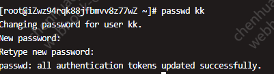

## 桌面运维

### 磁盘（C盘）空间不足

TreeSize Free 查看C盘剩余空间
Shop | JAM Software: https://customers.jam-software.de/downloadTrial.php?language=EN&article_no=80&mtm_campaign=ts_free-comp&mtm_kwd=ts-free-download

找到大文件目录，使用 FolderMove 进行迁移（C盘到F盘（空间有余））

1.6G的文件夹，C盘剩下一个快捷方式，F盘存放实际文件，这种方式不影响原来的软件功能

