## 设备

### 鼠标电池更换

20250928 12:07

## 桌面运维

### 磁盘（C盘）空间不足

TreeSize Free 查看C盘剩余空间
Shop | JAM Software: https://customers.jam-software.de/downloadTrial.php?language=EN&article_no=80&mtm_campaign=ts_free-comp&mtm_kwd=ts-free-download

找到大文件目录，使用 FolderMove 进行迁移（C盘到F盘（空间有余））

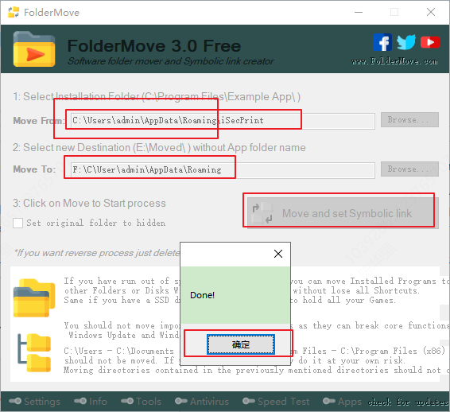

1.6G的文件夹，C盘剩下一个快捷方式，F盘存放实际文件，这种方式不影响原来的软件功能

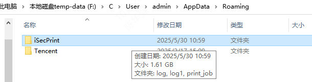

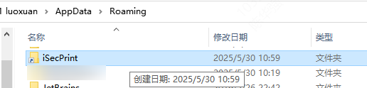

#### 20250606

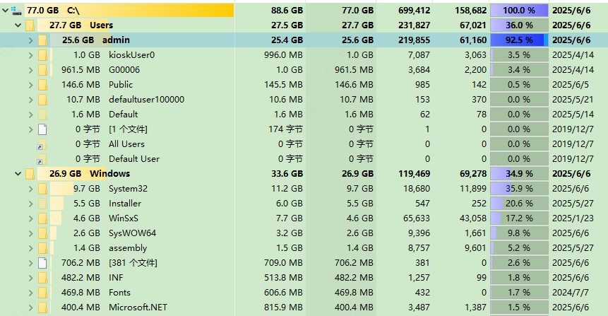

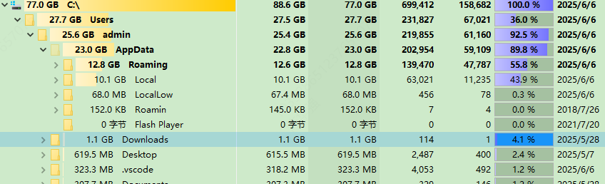

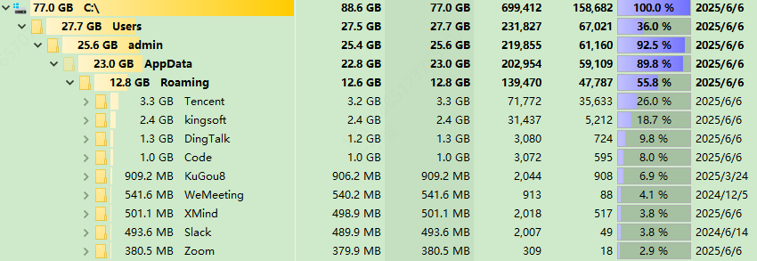

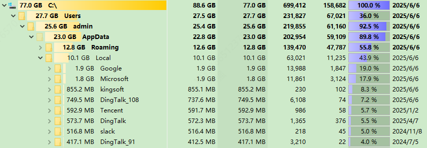

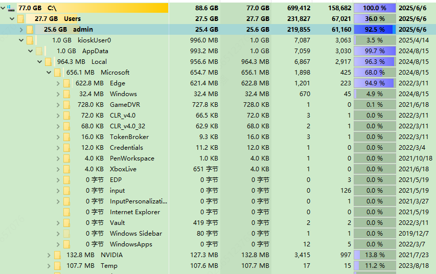

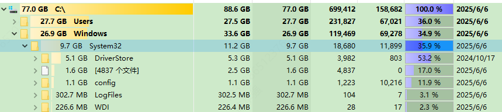

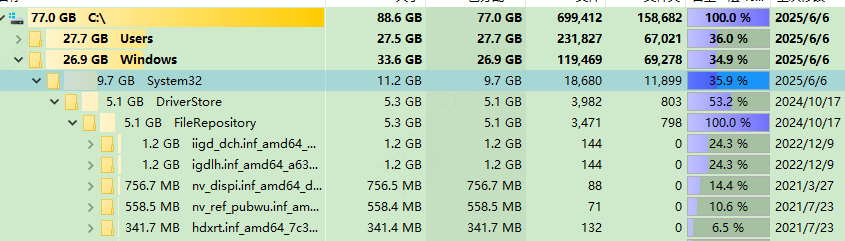

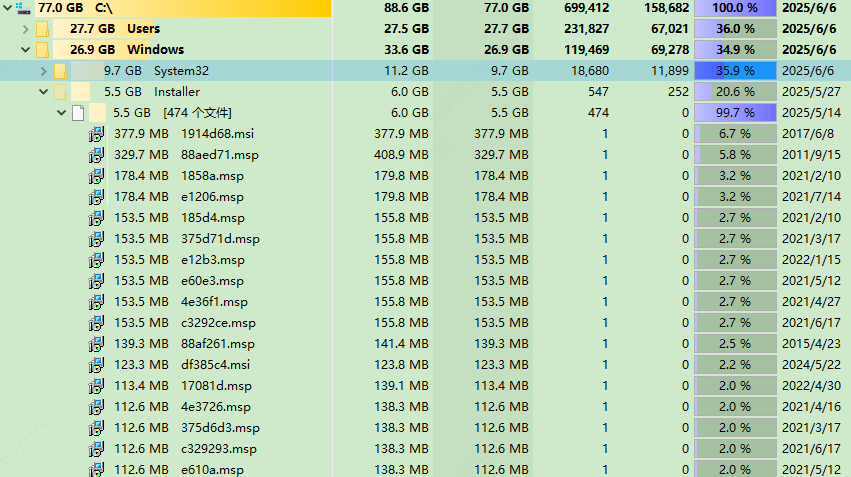

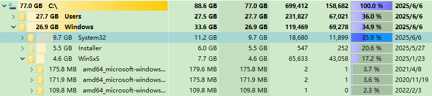

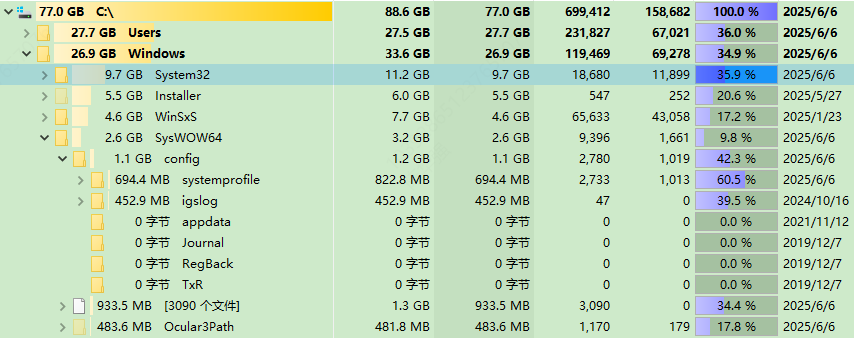

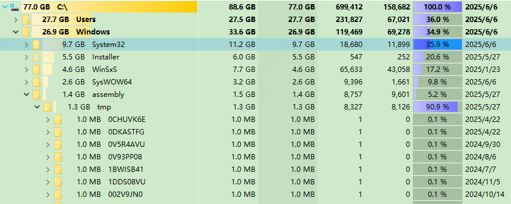

#### 20250612

C:\Users\admin\AppData\Roaming\Tencent\Wechat\ --> F:\C\User\admin\AppData\Roaming\Tencent 访问拒绝
C:\Users\admin\AppData\Roaming\Tencent\WeMail\ --> F:\C\User\admin\AppData\Roaming\Tencent
C:\Users\admin\AppData\Roaming\Tencent\QQ\ --> F:\C\User\admin\AppData\Roaming\Tencent
C:\Users\admin\AppData\Roaming\Tencent\Wemeet\ --> F:\C\User\admin\AppData\Roaming\Tencent 另一个程序已锁定文件的一部分，进程无法访问
C:\Users\admin\AppData\Roaming\kingsoft\ --> F:\C\User\admin\AppData\Roaming 由另一进程使用
C:\Users\admin\AppData\Roaming\Code\ --> F:\C\User\admin\AppData\Roaming 由另一进程使用
C:\Users\admin\AppData\Roaming\Kugou8\ --> F:\C\User\admin\AppData\Roaming

#### 20250613

C:\Users\admin\AppData\Roaming\WeMeeting\ --> F:\C\User\admin\AppData\Roaming
C:\Users\admin\AppData\Roaming\SLack\ --> F:\C\User\admin\AppData\Roaming
C:\Users\admin\AppData\Roaming\Zoom\ --> F:\C\User\admin\AppData\Roaming
C:\Users\admin\AppData\Local\ --> F:\C\User\admin\AppData
C:\Users\admin\AppData\Roaming\kingsoft\ --> F:\C\User\admin\AppData\Roaming 刚开机时进行操作可行

#### 20250708

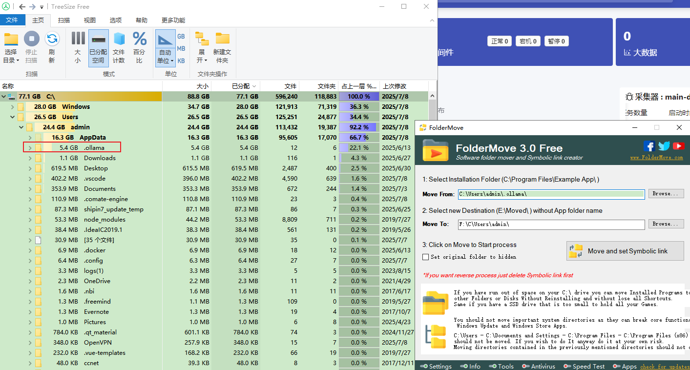

#### 20250625

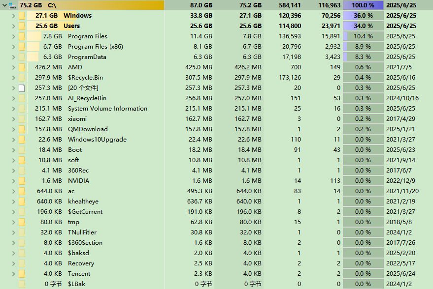

#### 20250815

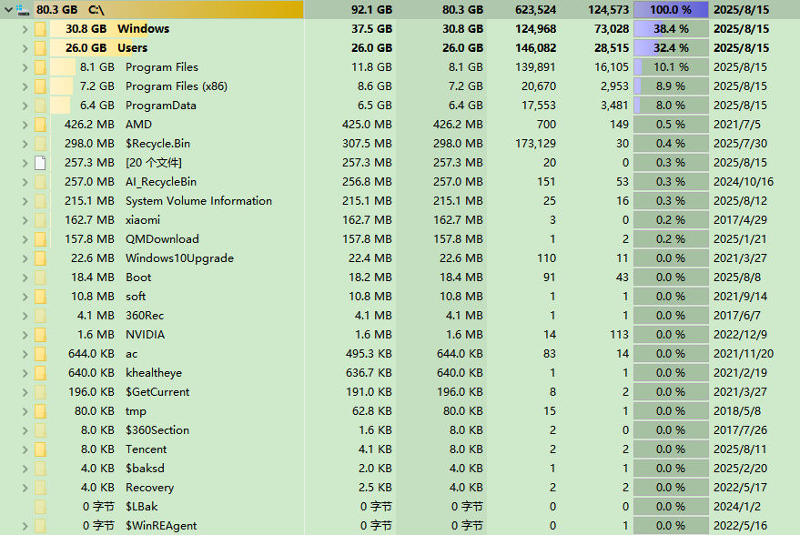

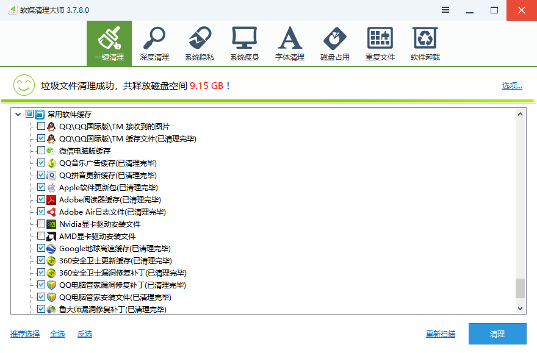

### 快捷方式等等

## 本地大模型

### 1. **Prometheus Stack（基于开源）**
   - **特点**：
     - 开源、灵活且可扩展性强。
     - 支持集成多种平台和数据源，例如不同服务器、数据库的性能数据。
     - 提供实时历史数据查看功能。
     - 支持多种告警规则：阈值超过或异常变化比例超过设定值。
   - **适用场景**：
     - 适合需要多平台数据集成和高度定制化的监控需求。
     - 支持构建复杂的监控系统，并与日志分析、故障诊断工具（如ELK架构）集成
。

### 2. **Zabbix（开源/免费版）**
   - **特点**：
     - 开源且免费，功能强大，支持多平台和多数据源集成。
     - 提供实时监控、历史数据回放功能。
     - 支持多种告警规则，并能通过邮件、 Slack 等方式通知。
   - **适用场景**：
     - 适合企业级的网络设备监控、服务器性能监控以及基础业务数据监控。

### 3. **Datto Dashboard（商业版）**
   - **特点**：
     - 商业-grade平台，支持多源数据集成（例如不同平台、服务器和数据库的数据
）。
     - 提供实时历史数据查看功能，并支持复杂的时间序列分析。
     - 集成多种告警规则，并能自定义阈值和异常检测逻辑。
   - **适用场景**：
     - 适合需要深度数据集成和智能告警的商业环境，能够处理大量结构化和非结构
化数据。

### 4. **用友 U-Monitor（商业版）**
   - **特点**：
     - 针对企业业务数据监控设计，支持多种业务数据源的集成。
     - 提供实时监控、历史数据分析和多维度告警规则设置。
     - 支持将告警信息与企业内报文系统集成，实现自动化响应。
   - **适用场景**：
     - 适合需要监控企业财务、运营、客户等多维度业务数据的企业。

### 5. **思元数据平台（商业版）**
   - **特点**：
     - 提供统一数据平台，支持多源异构数据集成和实时数据分析。
     - 支持告警规则的高级定制，并能通过地图视图、图表等方式展示数据。
     - 集成多种告警策略，支持阈值触发和异常变化检测。
   - **适用场景**：
     - 适合需要处理复杂数据架构的企业级监控系统。

### 6. **天眼数据（商业版）**
   - **特点**：
     - 提供统一平台来整合和分析来自不同来源的数据。
     - 支持实时数据监控、历史数据查询和告警规则设置。
     - 集成多种告警策略，包括阈值和异常变化检测。
   - **适用场景**：
     - 适合需要深度数据集成和智能分析的商业环境。

### 如何选择合适的工具？
1. **评估需求优先级**：确定您对性能监控、数据集成、告警功能的需求优先级。
2. **考虑技术栈**：如果您的团队熟悉开源项目（如Prometheus Stack），可以选择
免费开源工具；如果需要更复杂的功能或更高的安全性，可能需要选择商业版。
3. **测试和试用**：在实际环境中测试这些工具的功能，确保其符合您的需求。

### 获取更多信息
- **Prometheus Stack**: [https:///prometheus.io/](https://prometheus.io/)
- **Zabbix**: [https://www.zabbix.com/](https://www.zabbix.com/)
- **Datto Dashboard**:
[https://datto.com/products/dashboard/](https://datto.com/products/dashboa[https://datto.com/products/dashboard/](https://dato.com/products/dashboard/)
- **用友 U-Monitor**:
[http://www.youyou.com/products/analytics/](http://www.youyou.com/products[http://www.youyou.com/products/analytics/](http://ww.youyou.com/products/analytics/)
- **思元数据平台**:
[http://www.tiyangdata.com/](http://www.tiyangdata.com/)
- **天眼数据**: [https://tianyuedata.com/](https://tianyuedata.com/)

希望这些建议能帮您找到合适的统一监控工具！如果有更具体的需求或问题，欢迎随
时询问。