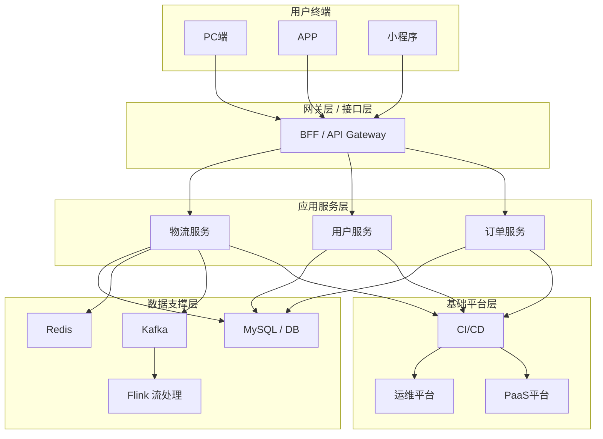

```mermaid
---
title: 物流系统整体架构（展示用户终端至平台层的整体分层结构）
---
%% 物流系统整体架构图
%% 本图展示从用户终端到接口层、服务层、数据层与平台层的分层结构
graph TD
  classDef node-no-border fill:#ffffcc,stroke:none;

  subgraph 1
    direction LR
    A1[PC端]
    A2[APP]
    A3[小程序]
    A4[m站]
    A5[用户对接程序<br>（ERP后台 / Shopify物流App / 电商独立站等）]
    A[用户终端]:::node-no-border
  end

  subgraph 2
    B0[CLB<br>（k8s或非k8s）]
    B1[BFF]
    B1[nginx]
    B[网关层 / 接口层]:::node-no-border
  end

  subgraph 3
    C1[物流服务]
    C2[用户服务]
    C3[导入服务<br>（页面/表格/三方授权]
    C4[导出服务<br>（表格/API）]
    C5[通知服务<br>（Webhook/邮件/短信）]
    C6[集成物流展示服务<br>（TrackingPage）]
    C7[客服服务<br>（客诉入口/客户对接）]
    C8[权限服务<br>（子账号功能）]
    C9[支付服务]
    C[应用服务层]:::node-no-border
  end

  subgraph 4
    D1[MySQL / PolarDB]
    D2[Redis]
    D3[Kafka]
    D4[Flink 流处理]
    D5[Elasticsearch]
    D6[OSS 对象存储]
    D[数据层]:::node-no-border
  end

  subgraph 5
    E1[CI/CD]
    E2[运维平台]
    E4[监控告警]
    E[基础平台层]:::node-no-border
  end

  A --> B
  B --> C
  C --> D
  D --> E
