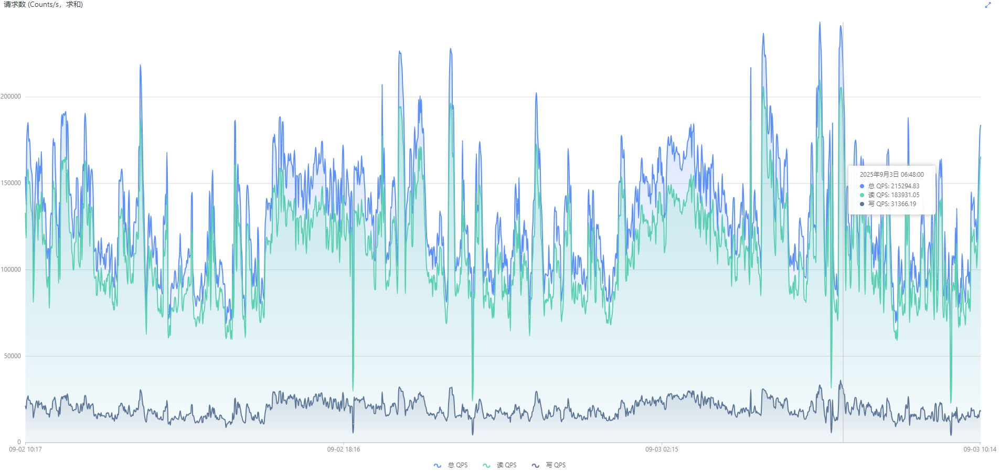
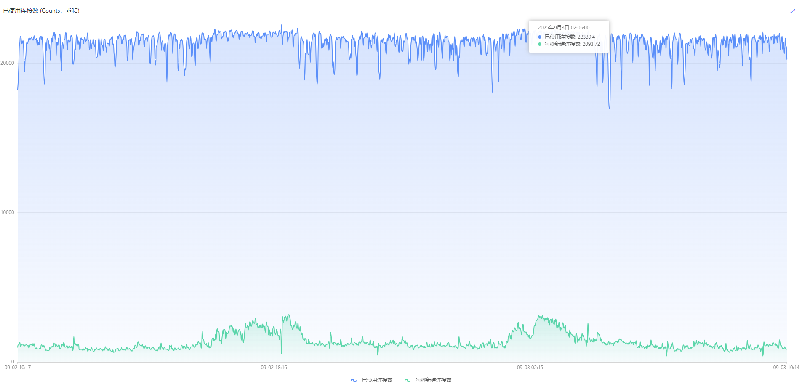
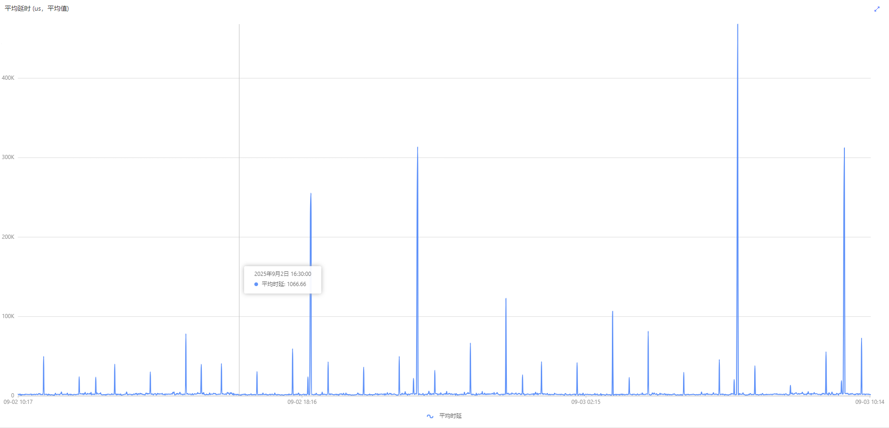
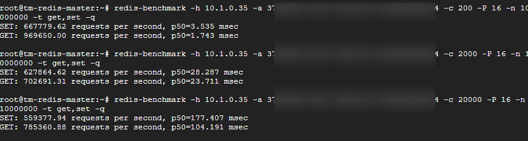
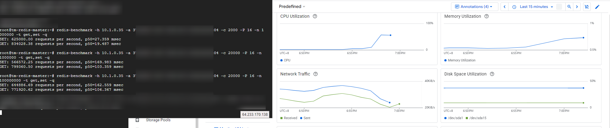
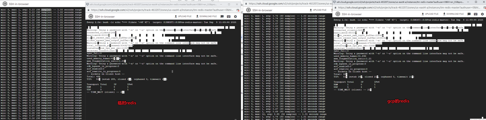
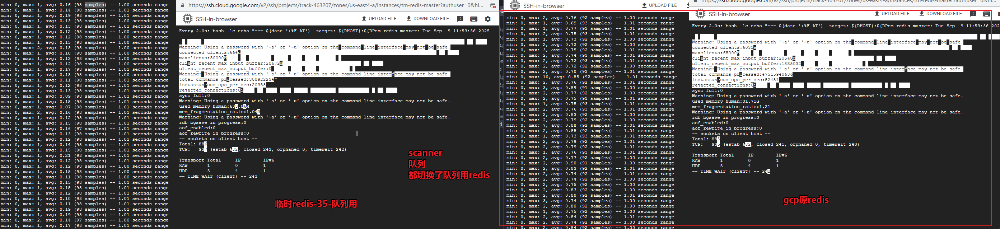
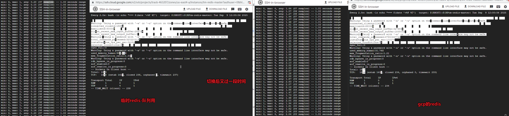
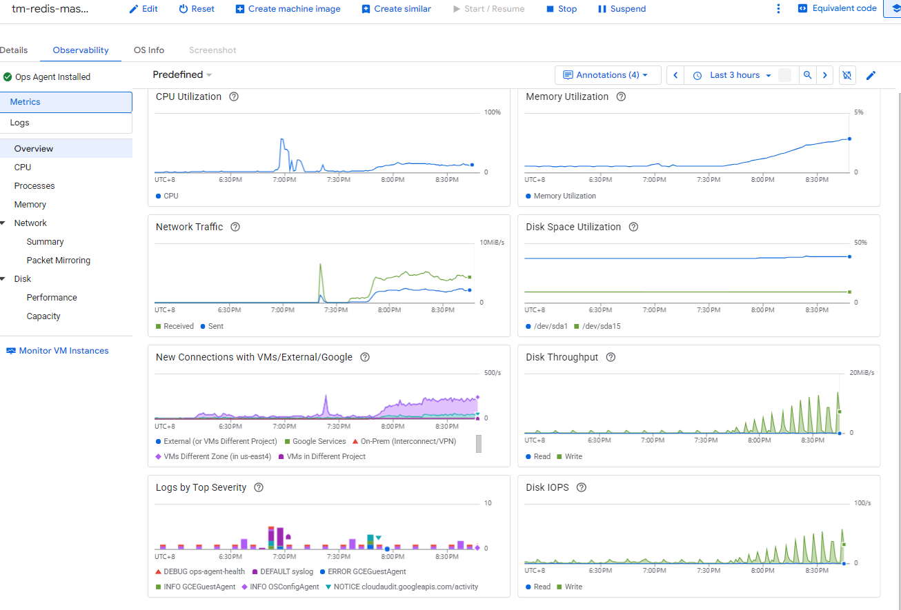

## 20250908

### 监控数据




```bash
# 阿里云0902-0903监控，
# 连接数大概22000
# 新建连接 2500
# QPS 180000 读 154000 写 25000
# 平均延时 1.5-3.5ms 偶发最大 300ms

# 阿里云配置
# hash-max-ziplist-entries 512
# slowlog-log-slower-than 20000（20ms）

bind 10.1.0.35 127.0.0.1
protected-mode yes
port 6379
# ---
# tcp-backlog 511
# 适用于10K+并发连接。
tcp-backlog 4096 
# 同阿里云保持一致
timeout 0
# ---
tcp-keepalive 300
daemonize yes
pidfile /run/redis/redis-server.pid
loglevel notice
logfile /var/log/redis/redis-server.log
databases 16
always-show-logo no
set-proc-title yes
proc-title-template "{title} {listen-addr} {server-mode}"
stop-writes-on-bgsave-error no
rdbcompression yes
rdbchecksum yes
dbfilename dump.rdb
rdb-del-sync-files no
dir /var/lib/redis
replica-serve-stale-data yes
replica-read-only yes
repl-diskless-sync yes
repl-diskless-sync-delay 5
repl-diskless-sync-max-replicas 0
repl-diskless-load disabled
repl-disable-tcp-nodelay no
replica-priority 100
acllog-max-len 128
requirepass 37a685b7-6c87-4949-b57c-9d163a259e04
lazyfree-lazy-eviction no
lazyfree-lazy-expire no
lazyfree-lazy-server-del no
replica-lazy-flush no
lazyfree-lazy-user-del no
lazyfree-lazy-user-flush no
oom-score-adj no
oom-score-adj-values 0 200 800
disable-thp yes
appendonly yes
appendfilename "appendonly.aof"
appenddirname "/data/redis"
appendfsync everysec
no-appendfsync-on-rewrite no
auto-aof-rewrite-percentage 100
auto-aof-rewrite-min-size 64mb
aof-load-truncated yes
aof-use-rdb-preamble yes
aof-timestamp-enabled no
# save 86400 1
# 1分钟至少10000个key发生变化，则dump内存快照，测试，建议低峰进行
save 60 10000
save 3600 1       # 60分钟内1次修改触发
save 900 1        # 15分钟内1次修改触发
save 300 10       # 5分钟内10次修改触发
 
# slowlog-log-slower-than 10000
# 阿里云
slowlog-log-slower-than 20000
slowlog-max-len 128
latency-monitor-threshold 0
notify-keyspace-events "KEA"
hash-max-listpack-entries 512
hash-max-listpack-value 64
list-max-listpack-size -2
list-compress-depth 0
set-max-intset-entries 512
zset-max-listpack-entries 128
zset-max-listpack-value 64
hll-sparse-max-bytes 3000
stream-node-max-bytes 4096
stream-node-max-entries 100
activerehashing yes
client-output-buffer-limit normal 0 0 0
client-output-buffer-limit replica 256mb 64mb 60
client-output-buffer-limit pubsub 32mb 8mb 60
hz 10
dynamic-hz yes
aof-rewrite-incremental-fsync yes
rdb-save-incremental-fsync yes
jemalloc-bg-thread yes

# 设置为物理内存的70%-80%，当前机器内存 128G 暂不调整 ---
# maxmemory 8gb

# 内存满时淘汰策略（仅淘汰过期键）
maxmemory-policy allkeys-lru
# 阿里云0902-0903监控，大概22000，配置为 25000 ---
maxclients 25000

# 默认是 4 多线程I/O（Redis 6.0+） ---
io-threads 8
# 小哈希key/val实体优化 同阿里云 ---
hash-max-ziplist-entries 512


# 配置修改需 需重启Redis服务或通过CONFIG REWRITE持久化到配置文件


# 性能测试
redis-benchmark -c 100 -n 100000


# # Linux系统优化，防止内存不足时OOM Killer终止Redis进程
# echo "vm.overcommit_memory=1" >> /etc/sysctl.conf
# echo "net.core.somaxconn=1024" >> /etc/sysctl.conf
# sysctl -p


# # 记录超过10ms的查询，可以设置大一点，10ms满足大部分场景
# # 在命令终端，可以通过SLOWLOG GET n 分析持久化相关慢操作‌
# slowlog-log-slower-than 10000  
# slowlog-max-len 128

# # 脚本健康检查（建议：通过脚本定期执行BGSAVE和BGREWRITEAOF命令）
# > INFO PERSISTENCE  # 查看RDB/AOF状态
# > BGREWRITEAOF      # 手动触发AOF重写


# 修改配置文件（需要重启）
tcp-backlog 4096 
io-threads 8

# 命令行修改
config set timeout 0
config set save '60 10000'
config set save '900 1'
config set save '300 10'
config set maxmemory-policy allkeys-lru
config set maxclients 25000

# 持久化配置文件
CONFIG REWRITE


# 备份
# sysctl 参数
sysctl -a > /var/backups/sysctl-$(date +%F).txt
# ulimit
ulimit -a > /var/backups/ulimit-$(date +%F).txt


sysctl -w net.core.somaxconn=4096
sysctl -w net.ipv4.tcp_max_syn_backlog=4096
sysctl -w fs.file-max=200000

永久修改：写入 /etc/sysctl.conf 或 /etc/sysctl.d/99-redis.conf

# Could not connect to Redis at 10.1.0.35:6379: Can't create socket: Too many open files
ulimit -n 100000
永久修改：/etc/security/limits.conf 或 systemd Unit 文件。

```


```txt

压测报错
-c 10000 -n 1
====== PING_INLINE ======                                         
  1 requests completed in 0.01 seconds
  10000 parallel clients
  3 bytes payload
  keep alive: 1
  host configuration "save": 300 10
  host configuration "appendonly": no
  multi-thread: no

Latency by percentile distribution:
0.000% <= 5.975 milliseconds (cumulative count 1)
100.000% <= 5.975 milliseconds (cumulative count 1)

Cumulative distribution of latencies:
0.000% <= 0.103 milliseconds (cumulative count 0)
100.000% <= 6.103 milliseconds (cumulative count 1)

Summary:
  throughput summary: 83.33 requests per second
  latency summary (msec):
          avg       min       p50       p95       p99       max
        5.972     5.968     5.975     5.975     5.975     5.975
====== PING_MBULK ======                                         
  1 requests completed in 0.01 seconds
  10000 parallel clients
  3 bytes payload
  keep alive: 1
  host configuration "save": 300 10
  host configuration "appendonly": no
  multi-thread: no

Latency by percentile distribution:
0.000% <= 5.911 milliseconds (cumulative count 1)
100.000% <= 5.911 milliseconds (cumulative count 1)

Cumulative distribution of latencies:
0.000% <= 0.103 milliseconds (cumulative count 0)
100.000% <= 6.103 milliseconds (cumulative count 1)

Summary:
  throughput summary: 83.33 requests per second
  latency summary (msec):
          avg       min       p50       p95       p99       max
        5.908     5.904     5.911     5.911     5.911     5.911
Could not connect to Redis at 10.1.0.35:6379: Cannot assign requested address

```

```bash

Cannot assign requested address ≈ 客户端没有可用的本地临时端口（或都在 TIME_WAIT），所以 1 万并发里绝大多数连接根本没连上；从输出来看只有 1 个请求真的完成（1 requests completed，吞吐 83 rps 只是统计误差），其余 9999 个连接创建失败。

立即修复（客户端＝跑 redis-benchmark 的那台机子）
先把端口池拉大、TIME_WAIT 缩短、允许重用，然后再测：
sysctl -w net.ipv4.ip_local_port_range="10240 65535"
sysctl -w net.ipv4.tcp_fin_timeout=15
sysctl -w net.ipv4.tcp_tw_reuse=1 
sysctl -w net.ipv4.tcp_timestamps=1

```

## 20250909

### 配置持久化

```bash

### 1) sysctl 持久化
sudo tee /etc/sysctl.d/99-redis.conf >/dev/null <<'EOF'
fs.file-max = 200000
net.core.somaxconn = 4096
net.ipv4.tcp_max_syn_backlog = 4096
net.ipv4.ip_local_port_range = 10240 65535
net.ipv4.tcp_tw_reuse = 1
net.ipv4.tcp_fin_timeout = 15
EOF
sudo sysctl --system

# 原始值变
systemctl show redis -p LimitNOFILE
LimitNOFILE=65535

### 2) systemd：为 Redis 服务设 LimitNOFILE
sudo systemctl edit redis <<'EOF'
[Service]
LimitNOFILE=100000
EOF

Editing "/etc/systemd/system/redis-server.service.d/override.conf" canceled: temporary file is empty.

sudo mkdir -p /etc/systemd/system/redis-server.service.d
sudo nano /etc/systemd/system/redis-server.service.d/override.conf

sudo systemctl daemon-reload
sudo systemctl restart redis

### 3) limits.conf：给登录会话（压测机/服务端都建议设）
### /etc/security/limits.conf 或 /etc/security/limits.d/90-nofile.conf
echo '* soft nofile 20000' | sudo tee -a /etc/security/limits.conf
echo '* soft nofile 20000' | sudo tee -a /etc/security/limits.d/90-nofile.conf
echo '* hard nofile 20000' | sudo tee -a /etc/security/limits.conf
echo '* hard nofile 20000' | sudo tee -a /etc/security/limits.d/90-nofile.conf
# 重新登录一个 shell 后验证：
ulimit -n

### 4) 验证
systemctl show redis -p LimitNOFILE
cat /proc/$(pidof redis-server)/limits | grep -i "open files"
sysctl net.ipv4.ip_local_port_range net.core.somaxconn net.ipv4.tcp_max_syn_backlog fs.file-max net.ipv4.tcp_tw_reuse

#### 回滚
# 删除 /etc/sysctl.d/99-redis.conf 即可。
# 删除 /etc/security/limits.d/90-nofile.conf
# 删除 systemctl edit redis 里的 LimitNOFILE 行


# 提高配置
# 修改redis配置
config set maxclients 50000
# 修改redis配置文件
tcp-backlog 8192 
# 修改配置 /etc/sysctl.d/99-redis.conf
net.core.somaxconn = 8192
net.ipv4.tcp_max_syn_backlog = 8192

```

### 进行压测




### 进行切换




